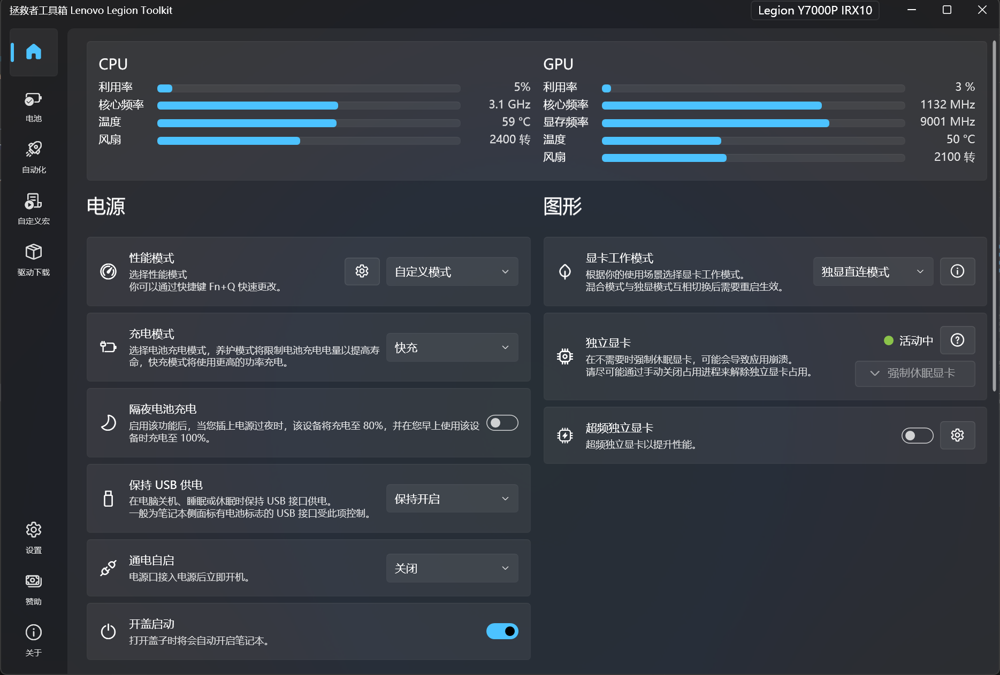

# Lenovo Legion Toolkit 拯救者工具箱

#### 原 README 文档:
* [English](docs/README.md)
* [简体中文](docs/README_zh-hans.md)
* [日本語版](docs/README_ja-JP.md)

---

## 介绍

Lenovo Legion Toolkit（拯救者工具箱）是专为**联想拯救者**系列笔记本打造的轻量化工具箱

可实现 `联想电脑管家` `Legion Zone` 的功能，并且纯净无广告，资源占用低

由原 [BartoszCichecki/LenovoLegionToolkit](https://github.com/BartoszCichecki/LenovoLegionToolkit) 分支而来，并增加了对新款拯救者笔记本的支持

## 使用教程

1. 在这里下载最新版安装包：[最新版安装包](https://github.com/ygxbnet/LenovoLegionToolkit/releases/latest)

2. 双击 `LenovoLegionToolkitSetup.exe` 安装包安装

3. 安装完成后即可使用

> 其它注意事项见：[补充文档-下载](https://github.com/ygxbnet/LenovoLegionToolkit/blob/main/docs/README_zh-hans.md#下载)

## 支持设备

- y7000p 2025

> 理论上目前所有联想拯救者笔记本都支持，但笔者只有 `y7000p 2025` 这一款设备
>
> 如果您在其他设备上也能正常运行，欢迎在 [issues](https://github.com/ygxbnet/LenovoLegionToolkit/issues) 中补充更正

## 软件截图

## 其他

笔者初次写软件 README 文档，为了尽可能保持简洁省去了很多内容

需要更多软件信息见：[补充文档（原 README 文档）](https://github.com/ygxbnet/LenovoLegionToolkit/blob/main/docs/README_zh-hans.md)

## 感谢

[@BartoszCichecki](https://github.com/BartoszCichecki)（项目原开发者）

社区诸位开发者

